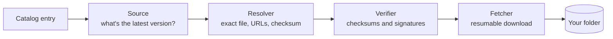

<div align="center">

# isoshelf

**Keep your bootable images up to date, on a Ventoy USB drive, a NAS share, or Proxmox ISO storage.**


</div>

> [!WARNING]
> isoshelf is in early development and doesn't do anything useful yet. This page
> describes what it's being built to do. See the [roadmap](#roadmap) for
> progress.

## Why

A drive full of ISOs goes stale quickly. Some are a few releases behind, some
distros have reached end of life, and some files have names you no longer
recognize. Checking each one by hand means visiting a dozen download pages and
comparing checksums.

isoshelf does that for you:

- **Inventory.** Scans a folder and works out which distro, edition,
  architecture and version each image is.
- **Update check.** Asks each project where its latest release is, using
  [endoflife.date](https://endoflife.date), GitHub releases, or the project's
  own download listings.
- **Verified downloads.** Downloads the new image, checks it against the
  project's published checksum (and signature, where one exists), and only
  then puts it in place.
- **Flags problems.** Reports end-of-life releases, checksum mismatches,
  files your boot menu won't list, and files it doesn't recognize.

## Safety first

isoshelf manages files you care about, so it is deliberately cautious:

- **It never touches partitions, bootloaders or Ventoy's own `ventoy/`
  folder.** It only works with image files in the folder you pick.
- **You decide what happens to old versions.** Each image has a *replace old
  file* checkbox, on by default; untick it to keep old versions side by side. A
  replacement is downloaded, verified and renamed into place before the old
  file is removed. A download that couldn't be verified never replaces anything
  without asking you first.
- **A checksum mismatch always blocks the file.** If a project publishes no
  checksum, the file is still allowed but marked *unverified*.
- **An update never switches tracks.** A 32-bit image never "updates" to a
  64-bit one, and an LTS release never jumps to a non-LTS one.
- **Checksums and signatures come only from the project's own HTTPS site.**
  Image bytes may come from a mirror, because they're verified against those
  checksums.

## Where it runs

| Target | How |
|---|---|
| **Ventoy USB drive** | Install isoshelf on your PC, or copy the portable folder onto the drive and run it from there. Portable mode keeps its settings, logs and temp files on the drive. |
| **Any folder** | Point it at a folder instead of a drive, such as ISOs on a NAS share. |
| **Proxmox ISO storage** | Point it at `/var/lib/vz/template/iso` (or `/mnt/pve/<storage>/template/iso` for NAS storage). Proxmox only lists `.iso` and `.img` files at the top level of that folder, and isoshelf follows the same rule. |
| **Server** *(planned)* | A Docker container, TrueNAS app or Proxmox LXC. Open it in your browser at `http://<server-ip>:<port>`, like your other homelab apps. It checks daily by default and keeps your images current. |

On your PC, isoshelf uses the same interface: it opens in your web browser, and
only your own computer can reach it.

## How it works



A built-in **catalog** describes each track: the filename pattern that
identifies it (for example `linuxmint-22.3-cinnamon-64bit.iso`), where to find
its latest version, and where its checksums are published. You can keep your
own copy of the catalog to add images the default one doesn't know about.

This is what `isoshelf check` is meant to print. It's an illustration, not real
output yet:

```text
$ isoshelf check E:\
STATUS            TRACK                      FILE                                  LATEST
up to date        Linux Mint Cinnamon        linuxmint-22.3-cinnamon-64bit.iso     22.3
update available  Pop!_OS 22.04 Intel/AMD    pop-os_22.04_amd64_intel_56.iso       58
update available  MX Linux (64-bit)          MX-21.3_x64.iso                       25.2
EOL               CentOS 7 (32-bit)          CentOS-7-i386-Minimal-2009.iso        -
not bootable      FydeOS for PC              FydeOS_for_PC_iris_v22.0-SP1-io.bin   -
manual            Hiren's BootCD PE          HBCD_PE_x64.iso                       -
unrecognized      -                          Windows.iso                           -
```

## Roadmap

**v0.1: read-only.** isoshelf only writes to its own `.isoshelf/` folder.

- [ ] Catalog loader and validation *(in progress)*
- [ ] Scanner: filename matching and content sniffing
- [ ] Drive state and history, including portable mode
- [ ] Update sources: endoflife.date, GitHub, listings, manual
- [ ] Command line: `isoshelf scan` and `isoshelf check`, with `--json`
- [ ] Web interface showing the same table, opened in your browser

**v0.2:** downloads, verification, replacing old files, and fixes for files the
boot menu won't list.<br>
**v0.3:** rebuild a drive from your usual set, and repair mode.<br>
**Later:** server mode (Docker, TrueNAS, Proxmox LXC) and a macOS build.

## Running from a USB drive on Linux

Many Linux desktops mount USB drives with `noexec`, which blocks running
programs from them. If the portable binary won't start, copy it to your home
folder and run it from there:

```bash
cp /media/$USER/Ventoy/isoshelf/isoshelf-linux-amd64 ~/
chmod +x ~/isoshelf-linux-amd64
~/isoshelf-linux-amd64
```

Adjust the first path to wherever your drive is mounted.

## Building from source

You need [Go](https://go.dev/dl/) 1.27 or newer.

```bash
git clone https://github.com/ZachCurry13/isoshelf.git
cd isoshelf
go test ./...
```

There's no program to run yet; for now this builds the code and runs the tests.

## License

[MIT](LICENSE).

isoshelf is an independent project. It isn't affiliated with or endorsed by
Ventoy, Proxmox, TrueNAS or any of the distributions it tracks. All names and
trademarks belong to their owners.
