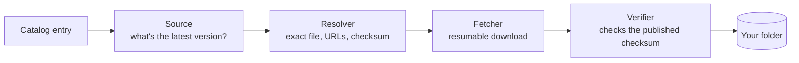

<div align="center">

# isoshelf

**Keep your bootable images up to date, on a Ventoy USB drive, a NAS share, or Proxmox ISO storage.**


</div>

> [!WARNING]
> isoshelf is in early development, but it works: it lists the images in a
> folder, checks them for updates, and downloads and verifies new ones, from a
> web page in your browser or the command line. See the [roadmap](#roadmap) for
> what's still missing.

## Why

A drive full of ISOs goes stale quickly. Some are a few releases behind, some
distros have reached end of life, and some files have names you no longer
recognize. Checking each one by hand means visiting a dozen download pages and
comparing checksums.

isoshelf does that for you:

- **Inventory.** Scans a folder and works out which distro, edition,
  architecture and version each image is.
- **Update check.** Asks each project where its latest release is, using
  [endoflife.date](https://endoflife.date), GitHub releases, or the project's
  own download listings. It does this by itself when you open the page, and
  remembers each answer for a day, so the list is right straight away without
  asking sixty websites every time. Refresh asks again; Settings turns it
  off.
- **Verified downloads.** Downloads the new image, checks it against the
  project's published checksum, and only then puts it in place. Interrupted
  downloads carry on where they stopped.
- **Your order, your pace.** Every image has its own Update button, so you're
  never forced to update everything at once. Add and Update join a download
  queue, like a game launcher's: one at a time, in an order you can change by
  dragging, with each button saying *Queued*, *Downloading* or *Added*.
- **Tidying up.** Remove images you no longer want: archive them (restore any
  time) or delete them. Older copies of the same image are found and cleared in
  one go. isoshelf remembers what left the folder and can download it again.
- **Works out what mystery files are.** A file the catalog doesn't know by
  name — `Windows.iso` from the Media Creation Tool, or something you renamed —
  gets a "What is this?" button. isoshelf reads what the disc says about
  itself, looks for the same image elsewhere in the folder, and suggests what
  it is, with the reason and how sure it is. You confirm; nothing is renamed
  or moved. If it's something no list will ever know — an image you built or
  customized — name it yourself and isoshelf remembers it from then on.
- **Flags problems.** Reports end-of-life releases, checksum mismatches,
  files your boot menu won't list, and files it doesn't recognize, and puts a
  ⚠ on images worth knowing about, such as releases that no longer get
  security fixes.
- **Says what wants doing.** Cards at the top of the page: updates ready,
  older versions you could clear, what's in the archive, files that won't
  boot, and anything it doesn't recognize. Each says how much space is
  involved and carries the button for it.
- **Plain words, explained.** Statuses read *Update ready*, *Old release*,
  *Check by hand* or *Won't boot here*, and each explains itself when you
  hover over it.
- **Finds things fast.** Search, one Filter menu (updates, favorites, older
  versions, kinds, architectures) showing a chip for everything switched on,
  and sorting by name, size, version or age. Click any image for a panel with
  everything about it: its file, its versions, its links and its settings.
  The catalog of images you *could* add has its own filters: kind,
  architecture, how it updates, what fits in this folder, and popular picks.
- **Knows what will fit.** Every image in the catalog shows about how big its
  download is, and the folder shows how much room is left, counting the
  downloads already queued. An image too big for the space says so instead of
  failing half way through.
- **Yours to set up.** One Settings panel with a search box: light, dark or
  whatever your computer is set to, higher contrast, larger text, less
  movement, and what should happen to the files updates replace. Nothing
  there has to be touched — the defaults are the sensible ones — and "Reset
  to defaults" puts every switch back without forgetting your folders.
- **Learns about new images on its own.** The list of images isoshelf knows is
  data, not code, so it refreshes itself from this repository — you get new
  distributions without installing a new isoshelf. It's a checkbox you can
  turn off, it only ever reads from here, and a list that doesn't pass every
  check is refused.

## Safety first

isoshelf manages files you care about, so it is deliberately cautious:

- **It never touches partitions, bootloaders or Ventoy's own `ventoy/`
  folder.** It only works with image files in the folder you pick.
- **Nothing is deleted unless you choose it.** Every removal asks first, and
  offers archiving, which keeps the file in the folder until you empty the
  archive, so it can be restored until then.
- **You decide what happens to old versions.** Each image has a *replace old
  file* switch, on by default; turn it off to keep old versions side by side.
  A replacement is downloaded, verified and renamed into place before the old
  file is removed. Images whose filename never changes (like
  `netboot.xyz.iso`) can't sit beside their old copy, so for those you choose
  between archiving and replacing.
- **A checksum mismatch always blocks the file.** If a project publishes no
  checksum, the file is still allowed but marked *unverified*, and it never
  replaces anything: your old file stays until you remove it yourself (or, if
  the name is the same, is archived rather than deleted).
- **An update never switches tracks.** A 32-bit image never "updates" to a
  64-bit one, and an LTS release never jumps to a non-LTS one.
- **Checksums come only from the project's own HTTPS site.** Image bytes may
  come from a mirror, because they're verified against those checksums.
  (Checking OpenPGP signatures as well is on the roadmap.)

## Where it runs

| Target | How |
|---|---|
| **Ventoy USB drive** | Install isoshelf on your PC, or copy the portable folder onto the drive and run it from there. Portable mode keeps its settings and temporary files on the drive. |
| **Any folder** | Point it at a folder instead of a drive, such as ISOs on a NAS share or your downloads. Compressed card images (`.img.xz`) count too. |
| **Proxmox ISO storage** | Point it at `/var/lib/vz/template/iso` (or `/mnt/pve/<storage>/template/iso` for NAS storage). Proxmox only lists `.iso` and `.img` files at the top level of that folder, and isoshelf follows the same rule. |
| **NAS or home server** | A container, including [TrueNAS SCALE as a custom app](docs/docker.md). isoshelf runs next to the files rather than across the network, which for a 6 GB image is the difference between minutes and hours. Open it from your own machine at `http://<server>:8765/?token=...`, like your other homelab apps. |

On your PC, isoshelf opens in your web browser and only your own computer can
reach it. In a container it has to answer to the machine's address instead, so
there the token in the link is what keeps everyone else out — treat it like a
password and keep it on a network you trust. [docs/docker.md](docs/docker.md)
is the walkthrough.

> **New to all this?** [Ventoy](https://www.ventoy.net) turns one USB stick
> into a boot menu of every ISO you drop on it, and isoshelf keeps those ISOs
> current. They work well together, but neither needs the other, and isoshelf
> isn't affiliated with Ventoy.

## How it works



A **catalog** describes each track: the filename pattern that identifies it
(for example `linuxmint-22.3-cinnamon-64bit.iso`), where to find its latest
version, and where its checksums are published. One ships inside isoshelf, and
it keeps itself current from this repository, so new images don't wait for a
new release. You can also keep your own catalog file, which isoshelf then
leaves alone.

It currently knows **86 images**, grouped by what they're for:

- **Desktop:** Ubuntu, Kubuntu and Xubuntu, Linux Mint and LMDE, Debian and
  Debian Live, Fedora, Arch, Omarchy, EndeavourOS, openSUSE Tumbleweed,
  NixOS, Zorin OS, Pop!_OS, CachyOS, MX, Manjaro, Q4OS, Tiny Core, FydeOS.
- **Gaming and handhelds:** Bazzite, Nobara (including its Steam Handheld
  edition), Batocera.
- **Server and homelab:** Proxmox VE, Backup Server and Mail Gateway,
  TrueNAS, Home Assistant OS, Rocky Linux, AlmaLinux, CentOS, FreeBSD,
  pfSense, Alpine, Ubuntu Server and Ubuntu Core.
- **Raspberry Pi and other boards:** Raspberry Pi OS (desktop and Lite), Home
  Assistant OS for the Pi 5, Ubuntu Core and Manjaro ARM.
- **Security and privacy:** Kali, Parrot, Qubes, Tails.
- **Rescue and tools:** Clonezilla, GParted Live, SystemRescue, Rescuezilla,
  netboot.xyz, Hiren's BootCD PE.
- **Windows**, which it recognizes and links to but never downloads.

The list updates itself without a new isoshelf; [CATALOG-CHANGES.md](CATALOG-CHANGES.md)
says what changed and when. Something missing? [Tell it about the image](https://github.com/ZachCurry13/isoshelf/issues/new?template=missing-image.yml):
requests are looked at every Monday, and every image in the list is checked
live against its project's own servers each week.

Here's `isoshelf check` on a test drive (trimmed, and the NOTE column shortened):

```text
$ isoshelf check E:\
STATUS                  TRACK                                VERSION   LATEST    FILE                                 NOTE
update available        Pop!_OS 22.04 (Intel/AMD)            56        58        pop-os_22.04_amd64_intel_56.iso
update available (EOL)  MX Linux Xfce (64-bit)               21.3      25.2      MX-21.3_x64.iso
EOL                     CentOS 7 Minimal (32-bit, archival)  2009      2009      CentOS-7-i386-Minimal-2009.iso
not bootable            FydeOS for PC (Intel Iris)           22.0-SP1  -         FydeOS_for_PC_iris_v22.0-SP1-io.bin  ... Make bootable can fix this
unrecognized            -                                    -         -         Windows.iso
manual                  Hiren's BootCD PE                    -         -         HBCD_PE_x64.iso
up to date              Linux Mint Cinnamon                  22.3      22.3      linuxmint-22.3-cinnamon-64bit.iso

25 image(s): 9 updates available, 1 EOL, 1 not bootable, 1 unrecognized, 12 manual, 1 up to date.
```

## Roadmap

**v0.1: read-only.** isoshelf only writes to its own `.isoshelf/` folder.

- [x] Catalog loader and validation
- [x] Scanner: filename matching and content sniffing
- [x] Drive state and history, including portable mode
- [x] Update sources: endoflife.date, GitHub, listings, manual
- [x] Command line: `isoshelf scan` and `isoshelf check`, with `--json`
- [x] Web interface showing the same table, opened in your browser

**v0.2: doing something about it.** The first released version.

- [x] Verified, resumable downloads
- [x] An Update button per image, and "Update all"
- [x] Removing images, with put-back, and an archive of what has left
- [x] Working out what unrecognized files are, and naming the rest yourself
- [x] Adding images from the catalog, with sizes and the room left
- [x] A download queue you can reorder
- [x] Older copies found and cleared in one go
- [x] Filters, sorting, logos and links
- [x] A catalog that keeps itself current

**v0.3.0: the redesign.** *Released 2026-09-21:* one page with a jump bar, a
row of things to do, plain-language statuses, one filter menu with chips, a
details panel for each image, Archive and History apart, and
[a layout for phones](https://github.com/ZachCurry13/isoshelf/issues/10).<br>
**v0.3.1: Settings.** *Released 2026-09-21:* one searchable Settings panel —
light and dark themes, higher contrast, larger text, less movement, what
happens to the files updates replace, and Reset to defaults.<br>
**v0.3.2: checking by itself.** *Released 2026-09-21:* the page checks for
updates when it opens and after each scan, remembers what each project said
for a day, and has one Refresh button. Both can be turned off in Settings.<br>
**v0.3.3: fixes and tidying.** *Released 2026-09-21:* the Filter menu stays
inside the window, a download that would overwrite a file asks what to do
instead of failing, American spelling, *Restore* in the archive, and the page
says how much room the images use and how much the queue will download.<br>
**v0.3.4: scanning while downloads run.** *Released 2026-09-21:* a scan or *Refresh*
is no longer refused while images download - the two run side by side, and
the page shows both. A scan also stops being able to undo the record of a
file a download had just placed.<br>
**v0.3.5: add a file from your computer.** *Released 2026-09-21:* drag an image onto
the page, or choose one, and it lands in the folder - for the images no
catalog knows. Nothing is written over without asking.<br>
**v0.3.6: keeping both, and reporting problems.** *Released 2026-09-21:* images whose
filename never changes can now be kept in both versions. When something goes
wrong, one button opens a bug report with the details filled in; isoshelf
sends nothing itself. Plus a plainer set of words throughout.<br>
**v0.3.7: the new file carries the version.** *2026-09-21:* when you keep
both copies, it's the new download that gets `-2.0.87` in its name; the file
already on your drive isn't touched at all.<br>
**v0.4.0: run it on your NAS.** *2026-09-21:* a container image for amd64 and
arm64, a compose file, and a walkthrough for adding it to TrueNAS SCALE as a
custom app.<br>
**v0.4.1: what the first real install found.** *2026-09-22:* the page no
longer scrolls sideways on a phone, and typing a server's address without the
link now says where the link is - in the app's log - instead of pointing at a
window that only exists on a desktop.<br>
**v0.4.2: records where you want them.** *2026-09-22:* what isoshelf has
worked out about a folder can be kept in isoshelf's own folder, or one you
pick, instead of inside the folder itself - for a drive it shouldn't be
writing to. Changing the answer moves it; nothing is forgotten.<br>
**v0.4.3: the folders isoshelf remembers.** *2026-09-22:* the folder chooser
now says when you last looked at each one, how many images it held and how
much room they took - and *Forget* takes one off the list without touching
anything in it.<br>
**Next:** where each folder's records live, and isoshelf updating itself with
one click.<br>
**v0.5:** [`isoshelf update` on the command
line](https://github.com/ZachCurry13/isoshelf/issues/1), [installing an older
version when a new one breaks something](https://github.com/ZachCurry13/isoshelf/issues/2),
[fixes for files the boot menu won't list](https://github.com/ZachCurry13/isoshelf/issues/3),
[two downloads at once from different servers](https://github.com/ZachCurry13/isoshelf/issues/4),
and [signature checking](https://github.com/ZachCurry13/isoshelf/issues/5),
along with a redesign of the page.<br>
**1.0:** an official TrueNAS app, so it installs from the store rather than as
a custom app.<br>
**Ongoing:** more images in the catalog. 86 so far; the wish list is in
[docs/catalog-sources.md](docs/catalog-sources.md), and
[requests are welcome](https://github.com/ZachCurry13/isoshelf/discussions/9).<br>
**Later:** rebuild a drive from your usual set; server mode (Docker, TrueNAS, Proxmox
LXC); a macOS build.

## Running from a USB drive on Linux

Many Linux desktops mount USB drives with `noexec`, which blocks running
programs from them. If the portable binary won't start, copy it to your home
folder and run it from there:

```bash
cp /media/$USER/Ventoy/isoshelf/isoshelf-linux-amd64 ~/
chmod +x ~/isoshelf-linux-amd64
~/isoshelf-linux-amd64
```

Adjust the first path to wherever your drive is mounted.

## Getting it

Download it from the [latest
release](https://github.com/ZachCurry13/isoshelf/releases/latest). There's no
installer and nothing to set up — it's one file.

Every file on that page starts with the version, like
`isoshelf-vX.Y.Z-…`, so pick the one whose name ends the way your row says.

| You're on | The file ending in | Then |
|---|---|---|
| **Windows** | `-windows-amd64.exe` | Double-click it. Windows may warn that it's from an unknown publisher: choose **More info → Run anyway**. isoshelf opens in your browser. |
| **Linux** | `-linux-amd64` (or `-linux-arm64`) | `chmod +x` the file, then run it |
| **A USB drive** | `-portable.zip` | Unzip it onto the drive. It keeps its settings on the drive and opens that drive by default. |

Each download carries its version, so you can tell two of them apart in your
Downloads folder. The files *inside* the portable zip don't: that's the copy
you run from the drive, and it keeps the same name every release so nothing
you've set up points at the wrong file.

Every release also has a `SHA256SUMS` file, if you'd like to check what you
downloaded is what was built.

isoshelf opens a page in your browser that only your own computer can reach.
Pick the folder your images live in, and it takes it from there.

## Building from source

You need [Go](https://go.dev/dl/) 1.27 or newer.

```bash
git clone https://github.com/ZachCurry13/isoshelf.git
cd isoshelf
go build ./cmd/isoshelf
```

That creates `isoshelf` (`isoshelf.exe` on Windows) in the current folder. Run it
without arguments (or double-click it) to open isoshelf in your web browser:

```bash
./isoshelf
```

Only your own computer can reach that page. Keep the window it opens while you
use it. From the command line instead:

```bash
./isoshelf check /path/to/your/isos
```

Use `scan` instead of `check` to stay offline, add `--profile proxmox` for
Proxmox ISO storage, or `--json` for scripts. `./isoshelf help` lists
everything. isoshelf only writes to a `.isoshelf` folder inside the folder you
check, plus its own settings folder.

To run the tests: `go test ./...`

## How this was built

isoshelf was written with the help of [Claude Code](https://claude.com/claude-code).
The commits carry a co-author line saying so, and it seems better to state it
plainly than to let anyone feel they'd caught me out.

I've wanted this tool for years. I have a drive full of ISOs, a NAS full of
more, and no realistic chance of hand-writing a checksum-verifying downloader
for dozens of distributions in my spare time. The choice was never "carefully
hand-written or machine-assisted" — it was "this exists or it doesn't".

What that did and did not change:

- **The rules are mine.** What it may delete and when it has to ask, that a
  failed checksum always blocks a file, that Windows images are a link and
  never a download, that it mirrors nothing — those decisions came first and
  are written down in [docs/design.md](docs/design.md), which the code follows.
- **Nothing in the catalog is guessed.** Every entry was checked against the
  project's own site before it went in, and every downloadable one is resolved
  live, from the project's own servers, before a catalog change goes out. Where a project's checksums can't be reached safely, the
  entry says so and refuses to download rather than pretending.
- **It's tested, and it's used.** The tests replay recorded responses so they
  never touch the network or a real disk, they run on Windows and Linux for
  every commit, and the thing itself runs against a real ISO folder on a NAS.
  The test fixtures are real filenames off a real Ventoy drive.
- **Bugs are mine to fix.** "The AI wrote it" is never an excuse here. If it
  does something it shouldn't, [tell me](https://github.com/ZachCurry13/isoshelf/issues)
  and I'll fix it.

If you'd rather not run software built this way, that's a fair call to make,
and the source is right here to judge for yourself.

## License

[MIT](LICENSE). isoshelf is free, and like all MIT software it comes as is,
without any warranty: see the license for the exact words. It is built to be
careful — nothing is deleted unless you choose it, and archiving (which can be
undone) is always offered — but keep a backup of anything you couldn't
download again.

Distro logos come from [Simple Icons](https://simpleicons.org) (CC0 1.0) and
are used to identify the projects they belong to.

isoshelf is an independent project. It isn't affiliated with or endorsed by
Ventoy, Proxmox, TrueNAS or any of the distributions it tracks. All names and
trademarks belong to their owners, and are used only to say which image a file
is.

isoshelf hosts nothing. It downloads images from each project's own servers to
your own machine, the same as clicking their download link, and checks them
against the checksums those projects publish. It doesn't mirror images, script
any vendor's download flow that isn't meant to be scripted, or have anything
to do with product keys or activation — Windows images are a link to
Microsoft's page and nothing more.

**Maintainers:** if one of these projects is yours and you'd rather not be
listed, or your entry points somewhere it shouldn't, please open an issue.
Entries are removed or corrected on request.

End-of-life dates, and many release versions, come from
[endoflife.date](https://endoflife.date) (MIT); the rest of the version
information comes from each project's own releases and checksum files.
