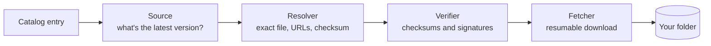

<div align="center">

# isoshelf

**Keep your bootable images up to date, on a Ventoy USB drive, a NAS share, or Proxmox ISO storage.**


</div>

> [!WARNING]
> isoshelf is in early development, but it works: it lists the images in a
> folder, checks them for updates, and downloads and verifies new ones, from a
> web page in your browser or the command line. See the [roadmap](#roadmap) for
> what's still missing.

## Why

A drive full of ISOs goes stale quickly. Some are a few releases behind, some
distros have reached end of life, and some files have names you no longer
recognize. Checking each one by hand means visiting a dozen download pages and
comparing checksums.

isoshelf does that for you:

- **Inventory.** Scans a folder and works out which distro, edition,
  architecture and version each image is.
- **Update check.** Asks each project where its latest release is, using
  [endoflife.date](https://endoflife.date), GitHub releases, or the project's
  own download listings.
- **Verified downloads.** Downloads the new image, checks it against the
  project's published checksum, and only then puts it in place. Interrupted
  downloads carry on where they stopped.
- **One image at a time.** Every image has its own Update button, so you're
  never forced to update everything at once.
- **Tidying up.** Remove images you no longer want, and put them back later if
  you change your mind. isoshelf remembers what left the folder and can
  download it again.
- **Works out what mystery files are.** A file the catalog doesn't know by
  name — `Windows.iso` from the Media Creation Tool, or something you renamed —
  gets a "What is this?" button. isoshelf reads what the disc says about
  itself, looks for the same image elsewhere in the folder, and suggests what
  it is, with the reason and how sure it is. You confirm; nothing is renamed
  or moved. If it's something no list will ever know — an image you built or
  customized — name it yourself and isoshelf remembers it from then on.
- **Flags problems.** Reports end-of-life releases, checksum mismatches,
  files your boot menu won't list, and files it doesn't recognize.
- **Finds things fast.** Filter by kind, architecture, updates or favourites;
  sort by name, size, version or age; and jump to each project's website,
  forum or release notes. The catalog of images you *could* add filters the
  same way, plus "can be downloaded" and "fits in this folder".
- **Knows what will fit.** Every image in the catalog shows about how big its
  download is, and the folder shows how much room is left. An image too big
  for the space says so instead of failing half way through.
- **Learns about new images on its own.** The list of images isoshelf knows is
  data, not code, so it refreshes itself from this repository — you get new
  distributions without installing a new isoshelf. It's a checkbox you can
  turn off, it only ever reads from here, and a list that doesn't pass every
  check is refused.

## Safety first

isoshelf manages files you care about, so it is deliberately cautious:

- **It never touches partitions, bootloaders or Ventoy's own `ventoy/`
  folder.** It only works with image files in the folder you pick.
- **You decide what happens to old versions.** Each image has a *replace old
  file* checkbox, on by default; untick it to keep old versions side by side. A
  replacement is downloaded, verified and renamed into place before the old
  file is removed. A download that couldn't be verified never replaces anything
  without asking you first.
- **A checksum mismatch always blocks the file.** If a project publishes no
  checksum, the file is still allowed but marked *unverified*.
- **An update never switches tracks.** A 32-bit image never "updates" to a
  64-bit one, and an LTS release never jumps to a non-LTS one.
- **Checksums and signatures come only from the project's own HTTPS site.**
  Image bytes may come from a mirror, because they're verified against those
  checksums.

## Where it runs

| Target | How |
|---|---|
| **Ventoy USB drive** | Install isoshelf on your PC, or copy the portable folder onto the drive and run it from there. Portable mode keeps its settings, logs and temp files on the drive. |
| **Any folder** | Point it at a folder instead of a drive, such as ISOs on a NAS share. |
| **Proxmox ISO storage** | Point it at `/var/lib/vz/template/iso` (or `/mnt/pve/<storage>/template/iso` for NAS storage). Proxmox only lists `.iso` and `.img` files at the top level of that folder, and isoshelf follows the same rule. |
| **Server** *(planned)* | A Docker container, TrueNAS app or Proxmox LXC. Open it in your browser at `http://<server-ip>:<port>`, like your other homelab apps. It checks daily by default and keeps your images current. |

On your PC, isoshelf uses the same interface: it opens in your web browser, and
only your own computer can reach it.

> **New to all this?** [Ventoy](https://www.ventoy.net) turns one USB stick
> into a boot menu of every ISO you drop on it, and isoshelf keeps those ISOs
> current. They work well together, but neither needs the other, and isoshelf
> isn't affiliated with Ventoy.

## How it works



A **catalog** describes each track: the filename pattern that identifies it
(for example `linuxmint-22.3-cinnamon-64bit.iso`), where to find its latest
version, and where its checksums are published. One ships inside isoshelf, and
it keeps itself current from this repository, so new images don't wait for a
new release. You can also keep your own catalog file, which isoshelf then
leaves alone.

It currently knows **72 images**: Ubuntu and its flavours, Linux Mint and
LMDE, Debian and Debian Live, Fedora, Arch, openSUSE Tumbleweed, Kali, Parrot,
Qubes, Alpine, Pop!_OS, CachyOS, Bazzite, MX, Manjaro, Q4OS, Tiny Core;
Proxmox VE and Backup Server, TrueNAS, FreeBSD, pfSense, Ubuntu Core;
Clonezilla, GParted Live, SystemRescue, Rescuezilla, netboot.xyz, Hiren's
BootCD PE; and Windows, which it inventories but never downloads. Something
missing? [Tell it about the image](https://github.com/ZachCurry13/isoshelf/issues/new?template=missing-image.yml).

Here's `isoshelf check` on a test drive (trimmed, and the NOTE column shortened):

```text
$ isoshelf check E:\
STATUS                  TRACK                                VERSION   LATEST    FILE                                 NOTE
update available        Pop!_OS 22.04 (Intel/AMD)            56        58        pop-os_22.04_amd64_intel_56.iso
update available (EOL)  MX Linux Xfce (64-bit)               21.3      25.2      MX-21.3_x64.iso
EOL                     CentOS 7 Minimal (32-bit, archival)  2009      2009      CentOS-7-i386-Minimal-2009.iso
not bootable            FydeOS for PC (Intel Iris)           22.0-SP1  -         FydeOS_for_PC_iris_v22.0-SP1-io.bin  ... Make bootable can fix this
unrecognized            -                                    -         -         Windows.iso
manual                  Hiren's BootCD PE                    -         -         HBCD_PE_x64.iso
up to date              Linux Mint Cinnamon                  22.3      22.3      linuxmint-22.3-cinnamon-64bit.iso

25 image(s): 9 updates available, 1 EOL, 1 not bootable, 1 unrecognized, 12 manual, 1 up to date.
```

## Roadmap

**v0.1: read-only.** isoshelf only writes to its own `.isoshelf/` folder.

- [x] Catalog loader and validation
- [x] Scanner: filename matching and content sniffing
- [x] Drive state and history, including portable mode
- [x] Update sources: endoflife.date, GitHub, listings, manual
- [x] Command line: `isoshelf scan` and `isoshelf check`, with `--json`
- [x] Web interface showing the same table, opened in your browser

**v0.2 (in progress):** downloads with verification, per-image updates,
removal with put-back, the archive of images that have left, filters, sorting,
logos, working out what unrecognized files are, naming the ones no list will
ever know, adding images from the catalog, and a catalog that updates itself.
Still to come: installing an older version when a new one breaks something,
and fixes for files the boot menu won't list.<br>
**Ongoing:** more images in the catalog. 72 so far; the wish list is in
[docs/catalog-sources.md](docs/catalog-sources.md), and requests are welcome.<br>
**v0.3:** rebuild a drive from your usual set, and repair mode.<br>
**Later:** server mode (Docker, TrueNAS, Proxmox LXC) and a macOS build.

## Running from a USB drive on Linux

Many Linux desktops mount USB drives with `noexec`, which blocks running
programs from them. If the portable binary won't start, copy it to your home
folder and run it from there:

```bash
cp /media/$USER/Ventoy/isoshelf/isoshelf-linux-amd64 ~/
chmod +x ~/isoshelf-linux-amd64
~/isoshelf-linux-amd64
```

Adjust the first path to wherever your drive is mounted.

## Building from source

You need [Go](https://go.dev/dl/) 1.27 or newer.

```bash
git clone https://github.com/ZachCurry13/isoshelf.git
cd isoshelf
go build ./cmd/isoshelf
```

That creates `isoshelf` (`isoshelf.exe` on Windows) in the current folder. Run it
without arguments (or double-click it) to open isoshelf in your web browser:

```bash
./isoshelf
```

Only your own computer can reach that page. Keep the window it opens while you
use it. From the command line instead:

```bash
./isoshelf check /path/to/your/isos
```

Use `scan` instead of `check` to stay offline, add `--profile proxmox` for
Proxmox ISO storage, or `--json` for scripts. `./isoshelf help` lists
everything. isoshelf only writes to a `.isoshelf` folder inside the folder you
check, plus its own settings folder.

To run the tests: `go test ./...`

## License

[MIT](LICENSE).

Distro logos come from [Simple Icons](https://simpleicons.org) (CC0 1.0) and
are used to identify the projects they belong to.

isoshelf is an independent project. It isn't affiliated with or endorsed by
Ventoy, Proxmox, TrueNAS or any of the distributions it tracks. All names and
trademarks belong to their owners, and are used only to say which image a file
is.

isoshelf hosts nothing. It downloads images from each project's own servers to
your own machine, the same as clicking their download link, and checks them
against the checksums those projects publish. It doesn't mirror images, script
any vendor's download flow that isn't meant to be scripted, or have anything
to do with product keys or activation — Windows images are a link to
Microsoft's page and nothing more.

**Maintainers:** if one of these projects is yours and you'd rather not be
listed, or your entry points somewhere it shouldn't, please open an issue.
Entries are removed or corrected on request.

Update dates come from [endoflife.date](https://endoflife.date) (MIT), and
version information from each project's own releases and checksum files.
