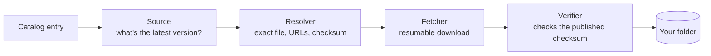

<div align="center">


# isoshelf

**Keep your bootable images up to date, on a Ventoy USB drive, a NAS share, or Proxmox ISO storage.**


</div>

> [!WARNING]
> **isoshelf is before 1.0.** It works — it lists the images in a folder,
> checks them for updates, and downloads and verifies new ones, from a web
> page in your browser or the command line — but things can still change
> between versions. 1.0 is the point at which it does what it says and won't
> change under you. See the [roadmap](#roadmap) for what's still missing.

## Why

A drive full of ISOs goes stale quickly. Some are a few releases behind, some
distros have reached end of life, and some files have names you no longer
recognize. Checking each one by hand means visiting a dozen download pages and
comparing checksums.

isoshelf does that for you:

- **Inventory.** Scans a folder and works out which distro, edition,
  architecture and version each image is.
- **Update check.** Asks each project where its latest release is, using
  [endoflife.date](https://endoflife.date), GitHub releases, or the project's
  own download listings. It does this by itself when you open the page, and
  remembers each answer for a day, so the list is right straight away without
  asking sixty websites every time. Refresh asks again; Settings turns it
  off.
- **Verified downloads.** Downloads the new image, checks it against the
  project's published checksum, and only then puts it in place. Interrupted
  downloads carry on where they stopped.
- **Your order, your pace.** Every image has its own Update button, so you're
  never forced to update everything at once. Add and Update join a download
  queue, like a game launcher's: one at a time, in an order you can change by
  dragging, with each button saying *Queued*, *Downloading* or *Added*.
- **Tidying up.** Remove images you no longer want: archive them (restore any
  time) or delete them. Older copies of the same image are found and cleared in
  one go. isoshelf remembers what left the folder and can download it again,
  and the archive can empty itself after 7, 30 or 90 days if you choose a
  number.
- **Flags problems.** Reports end-of-life releases, checksum mismatches,
  files your boot menu won't list, and files it doesn't recognize, and puts a
  ⚠ on images worth knowing about, such as releases that no longer get
  security fixes.
- **Works out what mystery files are.** A file the catalog doesn't know by
  name — `Windows.iso` from the Media Creation Tool, or something you renamed —
  gets a "What is this?" button. isoshelf reads what the disc says about
  itself, looks for the same image elsewhere in the folder, and suggests what
  it is, with the reason and how sure it is. You confirm; nothing is renamed
  or moved. If it's something no list will ever know — an image you built or
  customized — name it yourself and isoshelf remembers it from then on.

And the rest:

- **Your own files.** Drag an image onto the page, or choose one, and it goes
  straight into the folder. Nothing is written over without asking.
- **What wants doing, in one line.** Above the list: updates, older copies you
  could clear, images you usually keep that have gone missing, files that
  won't boot, anything unrecognized, and the archive. Click a count to see
  exactly those images; *Update all* sits at the end.
- **Where each file came from.** Each image's panel says whether isoshelf
  downloaded it, copied it from your server, or found it in the folder, and
  whether it matches the checksum the project publishes. *Check it* reads a
  file you added yourself and tells you, when you ask.
- **Duplicates, spotted.** The same image and version twice is counted above
  the list; *Make sure* compares the files when you ask, and *Remove this
  copy* goes through the archive.
- **Not now, or never.** Dismiss any update for 7, 30 or 90 days, or for
  good. It stays listed, greyed, and isn't counted; Settings lists what
  you've dismissed, with Undo.
- **Missing images come back in one click.** *Restore* if the file is still
  in the archive, *Download again* if isoshelf can fetch it, or its download
  page if not. Removed one on purpose? *Stop expecting it*.
- **Plain words.** Statuses read *Update available*, *End of life*,
  *Download manually* or *Won't boot from here*, and explain themselves when
  you hover over them.
- **Finding things.** Search, one Filter menu with a chip for everything
  switched on, sorting by name, size, version or age, and a panel with
  everything about an image when you click it, including a pin that keeps
  that exact file whatever updates come. The catalog of images you
  *could* add has its own filters.
- **What will fit.** Every catalog image shows about how big its download is,
  and the folder shows the room left, counting the queue, so an image too big
  says so before it starts.
- **Settings, if you want them.** One searchable panel: theme, contrast, text
  size, motion, what happens to the files updates replace, checking and
  updating by itself, where each folder's records are kept, and who can sign
  in when it runs on your network. The defaults are the sensible ones, and
  *Reset to defaults* keeps your folders.
- **Your folders, remembered.** The folder chooser lists the ones you've used,
  with when you last looked and how many images each held, even when the
  drive isn't plugged in. *Forget* takes one off the list without touching it.
- **One button when something's wrong.** *Report a problem* opens a bug report
  with the details filled in. You read it and send it yourself; isoshelf sends
  nothing.
- **Updating by itself, if you ask.** On a schedule, verified the same way,
  doing with each old copy what Settings says, never touching a pinned file,
  and stopping before the folder fills. Off unless you turn it on.
- **The short way round.** If another isoshelf on your network already has an
  image (the one on your NAS, usually), yours copies it from there, still
  checked against the project's own published checksum. *Add images* marks
  what your server has, catalog or not, and copies any of it in one click.
  Sharing is off until you turn it on, and like any file share, the licenses
  of what you share are yours to mind.
- **Updating itself, carefully.** **Update now** downloads the new isoshelf,
  checks this project's signature, lets image downloads finish and restarts
  into it. If the new version won't start, the old one comes back.
- **New images without a new isoshelf.** The list of images it knows is data,
  not code, and refreshes itself from this repository. It only ever reads
  from here, refuses a list that fails any check, and can be turned off.

## Safety first

isoshelf manages files you care about, so it is deliberately cautious:

- **It never touches partitions, bootloaders or Ventoy's own `ventoy/`
  folder.** It only works with image files in the folder you pick.
- **Nothing is deleted unless you choose it.** Every removal asks first, and
  offers archiving, which keeps the file in the folder until you empty the
  archive, so it can be restored until then.
- **You decide what happens to old versions.** One setting chooses between
  *Replace it*, *Move it to the archive* (undo any time) and *Keep both*, and
  **pinning** a file keeps that exact file whatever updates come: the new
  one downloads beside it, and nothing tidies it away.
  A replacement is downloaded, verified and renamed into place before the old
  file is touched. Images whose filename never changes (like
  `netboot.xyz.iso`) can still be kept in both versions: the **new** download
  gets the version in its name, and the file already on your drive isn't
  renamed at all.
- **A checksum mismatch always blocks the file.** If a project publishes no
  checksum, the file is still allowed but marked *unverified*, and it never
  replaces anything: your old file stays until you remove it yourself (or, if
  the name is the same, is archived rather than deleted).
- **An update never switches tracks.** A 32-bit image never "updates" to a
  64-bit one, and an LTS release never jumps to a non-LTS one.
- **Checksums come only from the project's own HTTPS site.** Image bytes may
  come from a mirror, because they're verified against those checksums.
  (Checking OpenPGP signatures as well is on the roadmap.)

## Where it runs

| Target | How |
|---|---|
| **Ventoy USB drive** | Run isoshelf on your PC, or copy the portable folder onto the drive and run it from there. Portable mode keeps its settings and temporary files on the drive. |
| **Any folder** | Point it at a folder instead of a drive, such as ISOs on a NAS share or your downloads. Compressed card images (`.img.xz`) count too. |
| **Proxmox ISO storage** | Point it at `/var/lib/vz/template/iso` (or `/mnt/pve/<storage>/template/iso` for NAS storage). Proxmox only lists `.iso` and `.img` files at the top level of that folder, and isoshelf follows the same rule. |
| **NAS or home server** | A container, including [TrueNAS SCALE as a custom app](docs/docker.md). isoshelf runs next to the files rather than across the network, which for a 6 GB image is the difference between minutes and hours. Open it from your own machine at `http://<server>:8765/` and sign in, like your other homelab apps. |

On your PC, isoshelf opens in your web browser and only your own computer can
reach it. In a container it has to answer to the machine's address instead, so
there it asks you to choose a username and password the first time you open
it — one login, not user accounts. Until you do, whoever opens it first gets
to choose, so do it straight away (or set them before it starts; the
walkthrough says how). Keep it on a network you trust.
[docs/docker.md](docs/docker.md) is the walkthrough.

> **New to all this?** [Ventoy](https://www.ventoy.net) turns one USB stick
> into a boot menu of every ISO you drop on it (more on it below), and
> isoshelf keeps those ISOs current. Neither needs the other.

### Tools that go with these

isoshelf keeps the images current. Writing one to a drive is somebody else's
job, and these are the ones worth having. Independent projects, none
affiliated with isoshelf; no versions or downloads are tracked here, only
what each one is for.

- **[Ventoy](https://www.ventoy.net)** — turns one USB stick into a boot menu
  of every image you drop on it, so adding an image is a file copy rather
  than a rewrite. The reason a folder of ISOs is worth keeping current.
- **[Rufus](https://rufus.ie)** — writes one image to a USB stick on Windows,
  and is the usual answer when a stick has to boot something awkward.
- **[balenaEtcher](https://etcher.balena.io)** — writes one image to a USB
  stick or SD card, on Windows, macOS and Linux, and checks what it wrote
  afterwards.
- **[Raspberry Pi Imager](https://www.raspberrypi.com/software/)** — writes
  card images for a Pi and the other small boards, and sets up the first boot
  before it does.

The same tools are listed on the page, under *Tools that go with these*.

## How it works



A **catalog** describes each track: the filename pattern that identifies it
(for example `linuxmint-22.3-cinnamon-64bit.iso`), where to find its latest
version, and where its checksums are published. One ships inside isoshelf, and
it keeps itself current from this repository, so new images don't wait for a
new release. You can also keep your own catalog file, which isoshelf then
leaves alone.

It currently knows **86 images**, grouped by what they're for:

- **Desktop:** Ubuntu, Kubuntu and Xubuntu, Linux Mint and LMDE, Debian and
  Debian Live, Fedora, Arch, Omarchy, EndeavourOS, openSUSE Tumbleweed,
  NixOS, Zorin OS, Pop!_OS, CachyOS, MX, Manjaro, Q4OS, Tiny Core, FydeOS.
- **Gaming and handhelds:** Bazzite, Nobara (including its Steam Handheld
  edition), Batocera.
- **Server and homelab:** Proxmox VE, Backup Server and Mail Gateway,
  TrueNAS, Home Assistant OS, Rocky Linux, AlmaLinux, CentOS, FreeBSD,
  pfSense, Alpine, Ubuntu Server and Ubuntu Core.
- **Raspberry Pi and other boards:** Raspberry Pi OS (desktop and Lite), Home
  Assistant OS for the Pi 5, Ubuntu Core and Manjaro ARM.
- **Security and privacy:** Kali, Parrot, Qubes, Tails.
- **Rescue and tools:** Clonezilla, GParted Live, SystemRescue, Rescuezilla,
  netboot.xyz, Hiren's BootCD PE.
- **Windows**, which it recognizes and links to but never downloads.

The list updates itself without a new isoshelf; [CATALOG-CHANGES.md](CATALOG-CHANGES.md)
says what changed and when. Something missing? [Tell it about the image](https://github.com/ZachCurry13/isoshelf/issues/new?template=missing-image.yml):
requests are looked at every Monday, and every image in the list is checked
live against its project's own servers each week.

Here's `isoshelf check` on a test drive (trimmed, and the NOTE column shortened):

```text
$ isoshelf check E:\
STATUS                  TRACK                                VERSION   LATEST    FILE                                 NOTE
update available        Pop!_OS 22.04 (Intel/AMD)            56        58        pop-os_22.04_amd64_intel_56.iso
update available (EOL)  MX Linux Xfce (64-bit)               21.3      25.2      MX-21.3_x64.iso
EOL                     CentOS 7 Minimal (32-bit, archival)  2009      2009      CentOS-7-i386-Minimal-2009.iso
not bootable            FydeOS for PC (Intel Iris)           22.0-SP1  -         FydeOS_for_PC_iris_v22.0-SP1-io.bin  ... Rename it to end in .img and it will boot.
unrecognized            -                                    -         -         Windows.iso
manual                  Hiren's BootCD PE                    -         -         HBCD_PE_x64.iso
up to date              Linux Mint Cinnamon                  22.3      22.3      linuxmint-22.3-cinnamon-64bit.iso

25 image(s): 9 updates available, 1 EOL, 1 not bootable, 1 unrecognized, 12 manual, 1 up to date.
```

## Roadmap

**Released:** everything from v0.1 (a read-only scan) to the newest release.
[CHANGELOG.md](CHANGELOG.md) says what each version held.

**Next:** the first notes on where to find the images you fetch yourself,
now that isoshelf can show them, and logos only where each project's own
policy allows them.

**Also planned:** [the Fedora entries that pin a release
number](https://github.com/ZachCurry13/isoshelf/issues/6),
[two downloads at once from different servers](https://github.com/ZachCurry13/isoshelf/issues/4),
[installing an older version when a new one breaks something](https://github.com/ZachCurry13/isoshelf/issues/2),
[fixes for files the boot menu won't list](https://github.com/ZachCurry13/isoshelf/issues/3),
and [signature checking for the images
themselves](https://github.com/ZachCurry13/isoshelf/issues/5).

**1.0:** an official TrueNAS app, so it installs from the store rather than as
a custom app.

**Ongoing:** more images in the catalog. 86 so far; the wish list is in
[docs/catalog-sources.md](docs/catalog-sources.md), and requests go through
[the catalog form](https://github.com/ZachCurry13/isoshelf/issues/new?template=missing-image.yml).

**Later:** [rebuild a drive from your usual
set](https://github.com/ZachCurry13/isoshelf/issues/11); [move a drive's
images to a new or bigger one](https://github.com/ZachCurry13/isoshelf/issues/12);
managing a NAS's folder from a desktop isoshelf, without mounting the share
(copying an image from another isoshelf already works; this is the folder
itself); a Proxmox LXC with the ISO storage bind-mounted, written down.

**On a Mac?** Use the [container version](docs/docker.md) with Docker
Desktop. There's no native Mac build planned; if you'd use one, say so in
[Discussions](https://github.com/ZachCurry13/isoshelf/discussions).

## Getting it

**On Linux, in one line:**

```bash
curl -fsSL https://raw.githubusercontent.com/ZachCurry13/isoshelf/main/install.sh | sh
```

That finds the newest release, downloads the program for your machine (x86-64
or ARM), checks it against the release's checksums, and puts it in
`~/.local/bin` as `isoshelf` — no `sudo`, nothing else touched. Then run
`isoshelf`. The script is [short enough to read first](install.sh), and a
weekly check runs it for real on both kinds of machine.

**Anywhere else,** download it from the [releases
page](https://github.com/ZachCurry13/isoshelf/releases) — the newest one at
the top. There's no installer and nothing to set up: it's one file.

(The releases page rather than "the latest release", so that a future
`-rc` build never hides the newest finished one.)

Every file on that page starts with the version, like
`isoshelf-vX.Y.Z-…`, so pick the one whose name ends the way your row says.

| You're on | The file ending in | Then |
|---|---|---|
| **Windows** | `-windows-amd64.exe` | Double-click it. Windows may warn that it's from an unknown publisher: choose **More info → Run anyway**. isoshelf opens in your browser. |
| **Linux** | `-linux-amd64` (or `-linux-arm64`) | `chmod +x` the file, then run it |
| **A USB drive** | `-portable.zip` | Unzip it onto the drive. It keeps its settings on the drive and opens that drive by default. |

Each download carries its version, so you can tell two of them apart in your
Downloads folder. The files *inside* the portable zip don't: that's the copy
you run from the drive, and it keeps the same name every release so nothing
you've set up points at the wrong file.

Every release also has a `SHA256SUMS` file, and from v0.6.0 its signature, if
you'd like to check what you downloaded is what was built.

isoshelf opens a page in your browser that only your own computer can reach.
Pick the folder your images live in, and it takes it from there.

### Running from a USB drive on Linux

Many Linux desktops mount USB drives with `noexec`, which blocks running
programs from them. If the portable binary won't start, copy it to your home
folder and run it from there:

```bash
cp /media/$USER/Ventoy/isoshelf/isoshelf-linux-amd64 ~/
chmod +x ~/isoshelf-linux-amd64
~/isoshelf-linux-amd64
```

Adjust the first path to wherever your drive is mounted.

### Updating it

From v0.6.0, isoshelf updates itself. When a new version is out, the top bar
says so, with an **Update now** button beside it. Press it and isoshelf
downloads the new version, checks it carries this project's signature, lets
any image downloads finish, and restarts into it; the page you have open
reconnects by itself. The portable folder is updated as a whole, and a single
download takes the plain name (`isoshelf-windows-amd64.exe`) the first time.
If the new version won't start, the old one is put back.

In a container, pull the new image instead. A copy older than v0.6.0 can't
update itself: download v0.6.0 or newer from the releases page once, and it
can from then on.

## Building from source

You need [Go](https://go.dev/dl/) 1.27 or newer.

```bash
git clone https://github.com/ZachCurry13/isoshelf.git
cd isoshelf
go build ./cmd/isoshelf
```

That creates `isoshelf` (`isoshelf.exe` on Windows) in the current folder. Run it
without arguments (or double-click it) to open isoshelf in your web browser:

```bash
./isoshelf
```

Only your own computer can reach that page. Keep the window it opens while you
use it. From the command line instead:

```bash
./isoshelf check /path/to/your/isos
```

Use `scan` instead of `check` to stay offline, add `--profile proxmox` for
Proxmox ISO storage, or `--json` for scripts. `scan` and `check` only write to
a `.isoshelf` folder inside the folder you check, plus isoshelf's own settings
folder. To download the updates as well:

```bash
./isoshelf update --move-aside /path/to/your/isos
```

`update` has no default for the old files: say `--keep`, `--move-aside` (to
the archive) or `--delete`. `--dry-run` says what it would download, and
`./isoshelf help` lists everything.

To run the tests: `go test ./...`

## How this was built

isoshelf was written with the help of [Claude Code](https://claude.com/claude-code).
The commits carry a co-author line saying so, and it seems better to state it
plainly than to let anyone feel they'd caught me out.

I've wanted this tool for years. I have a drive full of ISOs, a NAS full of
more, and no realistic chance of hand-writing a checksum-verifying downloader
for dozens of distributions in my spare time. The choice was never "carefully
hand-written or machine-assisted" — it was "this exists or it doesn't".

What that did and did not change:

- **The rules are mine.** What it may delete and when it has to ask, that a
  failed checksum always blocks a file, that Windows images are a link and
  never a download, that it mirrors nothing — those decisions came first and
  are written down in [docs/design.md](docs/design.md), which the code follows.
- **Nothing in the catalog is guessed.** Every entry was checked against the
  project's own site before it went in, and every downloadable one is resolved
  live, from the project's own servers, before a catalog change goes out.
  Where a project's checksums can't be reached safely, the entry says so and
  refuses to download rather than pretending.
- **It's tested, and it's used.** The tests replay recorded responses so they
  never touch the network or a real disk, they run on Windows and Linux for
  every commit, and the thing itself runs against a real ISO folder on a NAS.
  The test fixtures are real filenames off a real Ventoy drive.
- **Bugs are mine to fix.** "The AI wrote it" is never an excuse here. If it
  does something it shouldn't, [tell me](https://github.com/ZachCurry13/isoshelf/issues)
  and I'll fix it.

If you'd rather not run software built this way, that's a fair call to make,
and the source is right here to judge for yourself.

## License

[MIT](LICENSE). isoshelf is free, and like all MIT software it comes as is,
without any warranty: see the license for the exact words. It is built to be
careful — nothing is deleted unless you choose it, and archiving (which can be
undone) is always offered — but keep a backup of anything you couldn't
download again.

Distro logos come from [Simple Icons](https://simpleicons.org) (CC0 1.0) and
are used to identify the projects they belong to.

isoshelf is an independent project. It isn't affiliated with or endorsed by
Ventoy, Proxmox, TrueNAS or any of the distributions it tracks. All names and
trademarks belong to their owners, and are used only to say which image a file
is.

isoshelf hosts nothing. It downloads images from each project's own servers to
your own machine, the same as clicking their download link, and checks them
against the checksums those projects publish. It doesn't mirror images, script
any vendor's download flow that isn't meant to be scripted, or have anything
to do with product keys or activation — Windows images are a link to
Microsoft's page and nothing more.

**Maintainers:** if one of these projects is yours and you'd rather not be
listed, or your entry points somewhere it shouldn't, please open an issue.
Entries are removed or corrected on request.

End-of-life dates, and many release versions, come from
[endoflife.date](https://endoflife.date) (MIT); the rest of the version
information comes from each project's own releases and checksum files.
